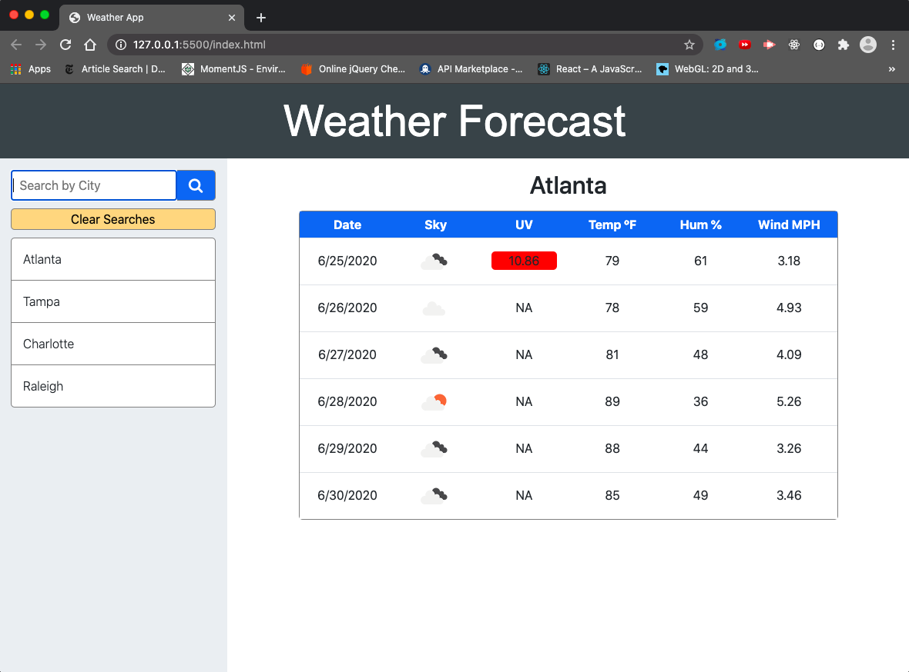
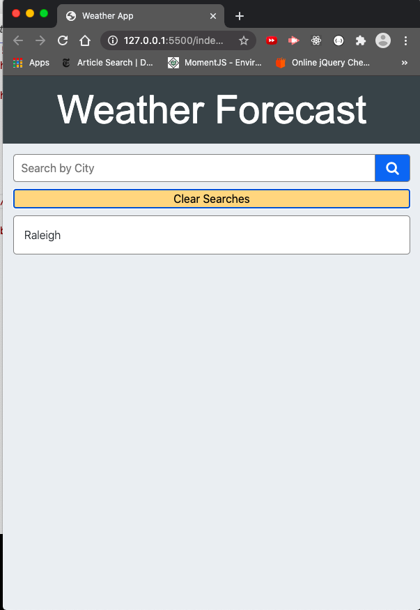
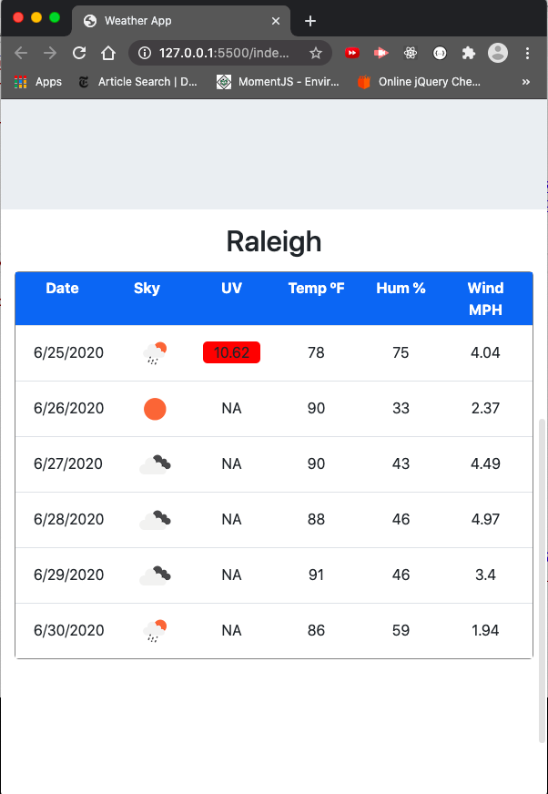

# Weather Forecast App

## Description

> Here is an app that returns basic weather forecasting data based on a given city.

## Deployment

> Just open in the browser.

## Features

> #### Frontend: 
>
> ​	This app feature a responsive bootstrap UI that looks great on desktop or mobile.
>
> #### Functionality:
>
> ​	The Search bar allows you to enter cities and search by hitting enter or clicking the search button. The table will then update with the given cities forecast for the current day and upcoming 5 days. The UV index field will be color coded based on the level of the UV index. A four color scale from Green -> Yellow -> Orange -> Red is used. After searching for a given city, the city is listed in the search history. Clicking on the city name in the search history will bring that city back up and relist it in the search history. Once the list gets a bit long, the "Clear Searches" button can be used to reset the list to the default city of Raleigh, NC. The users search history is stored locally, so refreshing the browser will not eliminate the search history. 
>
> 

## Images

> 
>
> 
>
> 
>
> 